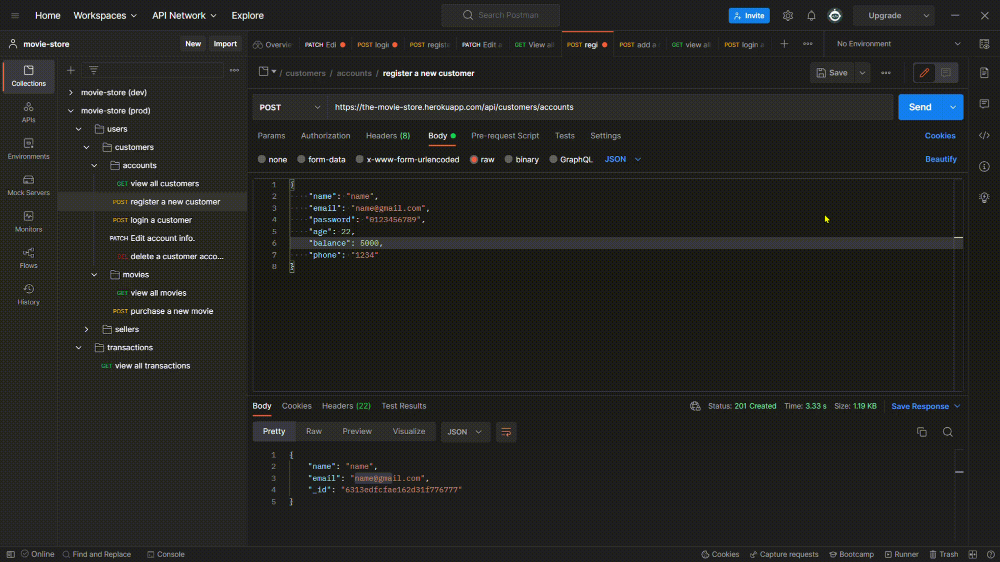
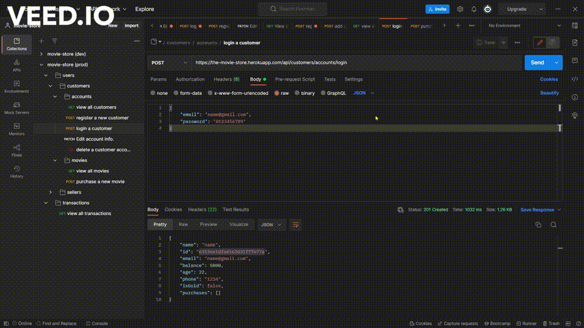

## 📒 Brief description

This is a REST API Service Application for selling and purchasing movies in which users can create accounts either as customers or sellers.

---
## 🔗 Available Endpoints:

<div>
    
</div>
    
   
---

## 🚀 How to use
Import the above postman collection ```movie-store (production).json``` to [postman](https://www.postman.com/planetary-meteor-85425/workspace/new-team-workspace/documentation/18249768-38adacb4-d8f7-4365-9ee0-fa1d59a3bd03) by ```cloning``` the repo or through this [google-drive-link](https://drive.google.com/drive/folders/1LOGQK0fOH9bV05ISMdq2P6cBniGTQEIP) 

---
## ⭐ Quick Demo

#### seller


#### customer




---
## 🔧 Endpoints signatures

* #### customer

    * **view all customers:**
     ``https://the-movie-store.herokuapp.com/api/customers/accounts``
    ``GET `` &nbsp; returns all customer users
    <br>

    * **signup:**
     ``https://the-movie-store.herokuapp.com/api/customers/accounts`` 
   ``POST``  &nbsp; returns customer information and token to the response header
    <br>

    * **login:**
     ``https://the-movie-store.herokuapp.com/api/customers/accounts/login`` 
   ``POST``  &nbsp; returns customer information and token to the response header
    <br>

    * **edit profile:**
     ``https://the-movie-store.herokuapp.com/api/customers/accounts/edit/`` 
   ``PATCH`` &nbsp; ``require Authorization`` &nbsp; returns the new customer information
    <br>

    * **delete Account:**
     ``https://the-movie-store.herokuapp.com/api/customers/accounts/remove/`` 
   ``DELETE`` &nbsp; ``require Authorization`` &nbsp; returns the deleted   customer
    <br>
    
    * **View all movies:**
     ``https://the-movie-store.herokuapp.com/api/customers/movies/`` 
   ``GET`` &nbsp; returns an array of avaiable moviess
    <br>
    * **purchase a movie:**
     ``https://the-movie-store.herokuapp.com/api/customers/movies/`` 
   ``POST`` &nbsp; ``require Authorization`` &nbsp; returns transaction   document
    <br>

* #### seller
    * **view all users:**
     ``https://the-movie-store.herokuapp.com/api/sellers/accounts``
    ``GET `` &nbsp; returns all seller users
    <br>

    * **signup:**
     ``https://the-movie-store.herokuapp.com/api/sellers/accounts`` 
   ``POST``  &nbsp; returns seller information and token to the response header
    <br>

    * **login:**
     ``https://the-movie-store.herokuapp.com/api/sellers/accounts/login`` 
   ``POST``  &nbsp; returns seller information and token to the response header
    <br>

    * **edit profile:**
     ``https://the-movie-store.herokuapp.com/api/sellers/accounts/edit/`` 
   ``PATCH`` &nbsp; ``require Authorization`` &nbsp; returns the new seller information
    <br>

    * **add a movie :**
     ``https://the-movie-store.herokuapp.com/api/customers/movies/`` 
   ``POST`` &nbsp; ``require Authorization`` &nbsp; returns the added movie
    <br>

* #### transactions

    * **view all transactions:**
     ``https://the-movie-store.herokuapp.com/api/transactions`` 
   ``GET`` &nbsp; returns all transaction sorted by creation time
    <br>
---

## 💡 features
* CRUD Operations ✅
* Registering & logging ✅
* Authentication and authorization ✅
* collections transaction ✅
* HTTPS protocol ✅
* security best practice ✅
* Error handling ✅
* Develop production-ready REST API's ✅

---
## 🔨 Built with

#### this app built by [node js](https://nodejs.org/en/download/) along with [Express](https://expressjs.com/) as HTTP framework, and [MongoDB Atlas](https://www.mongodb.com/cloud/atlas/lp/try4?utm_source=google&utm_campaign=gs_emea_egypt_search_core_brand_atlas_desktop&utm_term=mongodb%20atlas&utm_medium=cpc_paid_search&utm_ad=e&utm_ad_campaign_id=12212624392&adgroup=115749716863&gclid=CjwKCAjw9suYBhBIEiwA7iMhNFkgbJE19QkWmgp4O28u08xluGDC3XCI--OfdgBUaGVQnDwb-irozRoCUpUQAvD_BwE) for storing data on cloud database

 **Main packages** [fawn](https://www.npmjs.com/package/fawn) to implement [transaction](https://www.mongodb.com/docs/manual/core/transactions/) on the embeded documents
 [jsonwebtoken](https://www.npmjs.com/package/jsonwebtoken) to generate tokens , [mongoose](https://www.npmjs.com/package/mongoose) for data modeling , [bcrypt](https://www.npmjs.com/package/bcrypt) to hash passwords, [joi](https://www.npmjs.com/package/joi) validating request body

 **Developer tools** [Git](https://www.npmjs.com/package/bcrypt) for Versioning, [Heroku](https://id.heroku.com/login) for deployment, [postman](ttps://www.postman.com/planetary-meteor-85425/workspace/new-team-workspace/documentation/18249768-38adacb4-d8f7-4365-9ee0-fa1d59a3bd03) for building and testing API Endpoints.

---
