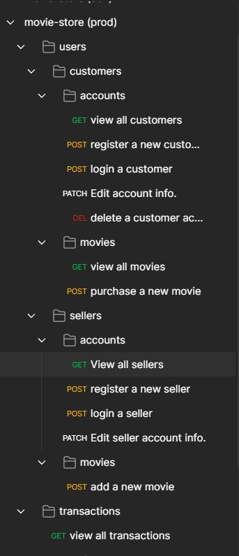

## Brief description 📒

This is a REST API Service project for selling and purchasing movies in which users are able to create accounts either as customers or sellers.

---
## 🔗 Available Endpoints:

    

    
---

## 🚀 How to use
Import the above collection to [postman]() by the this [google-drive-link]() 

---
## ⭐ Short Demo

---
## 🔧 Endpoints signatures

* #### customer

    * **view all customers:** ``https://the-movie-store.herokuapp.com/api/customers/accounts``
    ``GET `` &nbsp; returns all customer users
     

    * **signup:** ``https://the-movie-store.herokuapp.com/api/customers/accounts`` 
   ``POST``  &nbsp; returns customer information and token to the response header
     

    * **login:** ``https://the-movie-store.herokuapp.com/api/customers/accounts/login`` 
   ``POST``  &nbsp; returns customer information and token to the response header
     

    * **edit profile:** ``https://the-movie-store.herokuapp.com/api/customers/accounts/edit/`` 
   ``PATCH`` &nbsp; ``require Authorization`` &nbsp; returns the new customer information
     

    * **delete Account:** ``https://the-movie-store.herokuapp.com/api/customers/accounts/remove/`` 
   ``DELETE`` &nbsp; ``require Authorization`` &nbsp; returns the deleted   customer
     
    
    * **View all movies:** ``https://the-movie-store.herokuapp.com/api/customers/movies/`` 
   ``GET`` &nbsp; returns an array of avaiable moviess
     
    * **purchase a movie :** ``https://the-movie-store.herokuapp.com/api/customers/movies/`` 
   ``POST`` &nbsp; ``require Authorization`` &nbsp; returns transaction   document
     

* #### seller
    * **view all users:** ``https://the-movie-store.herokuapp.com/api/sellers/accounts``
    ``GET `` &nbsp; returns all seller users
     

    * **signup:** ``https://the-movie-store.herokuapp.com/api/sellers/accounts`` 
   ``POST``  &nbsp; returns seller information and token to the response header
     

    * **login:** ``https://the-movie-store.herokuapp.com/api/sellers/accounts/login`` 
   ``POST``  &nbsp; returns seller information and token to the response header
     

    * **edit profile:** ``https://the-movie-store.herokuapp.com/api/sellers/accounts/edit/`` 
   ``PATCH`` &nbsp; ``require Authorization`` &nbsp; returns the new seller information
     

    * **add a movie :** ``https://the-movie-store.herokuapp.com/api/customers/movies/`` 
   ``POST`` &nbsp; ``require Authorization`` &nbsp; returns the added movie
     

* #### transactions

    * **add a movie :** ``https://the-movie-store.herokuapp.com/api/transactions`` 
   ``GET`` &nbsp; returns all transaction sorted by creation time
     
---

## 💡 features
* CRUD Operations ✅
* Registering & logging ✅
* Authentication and authorization ✅
* collections transaction ✅
* HTTPS protocol ✅
* security best practice ✅
* Error handling ✅
* Develop production-ready REST API's ✅

---
## 🔨 Built with
######this app built by [node js]() along with [Express]() as HTTP framework, and [MongoDB Atlas]() for storing data on cloud database

 **main packages** [fawn]() to enforce [two phase commit]() on the embeded documents
 [jsonwebtoken]() to generate tokens , [mongoose]() for data modeling , [bcrypt]() to hash passwords, [joi]() validating request body

 **developer tools** [Git]() for Versioning, [Heroku]() for deployment, [postman]() for building and testing API Endpoints.

---
.center{
    display: block;
  margin-left: auto;
  margin-right: auto;
  width: 50%;
}